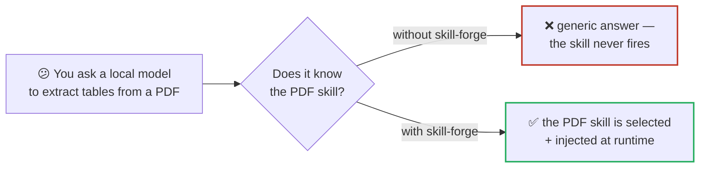
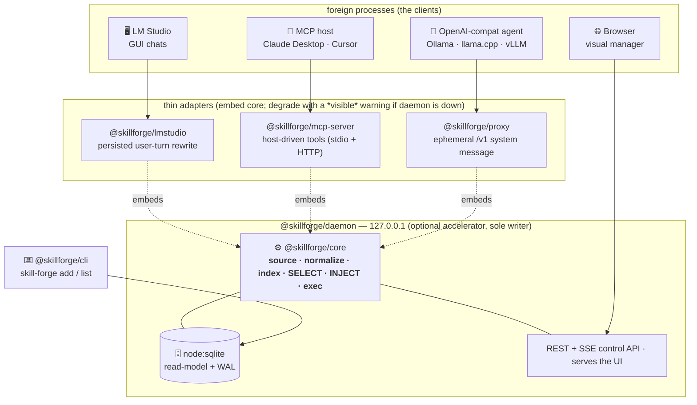
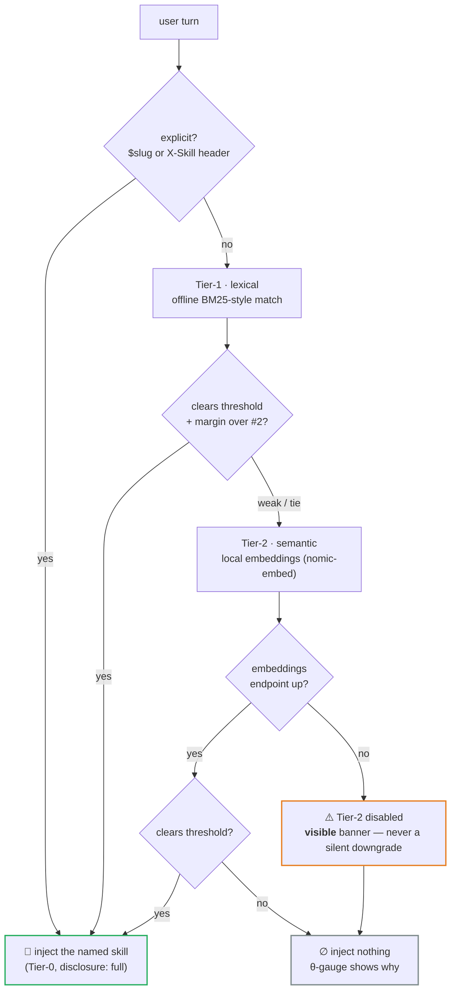
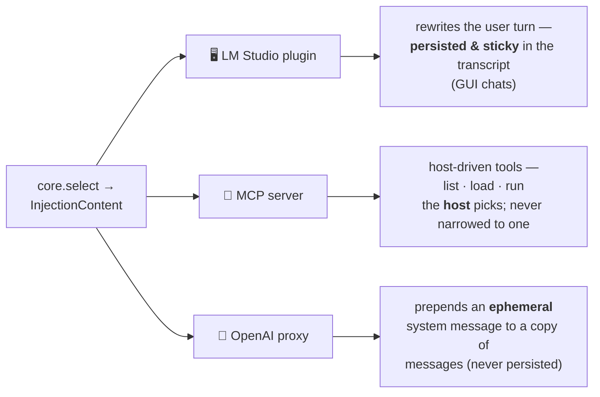
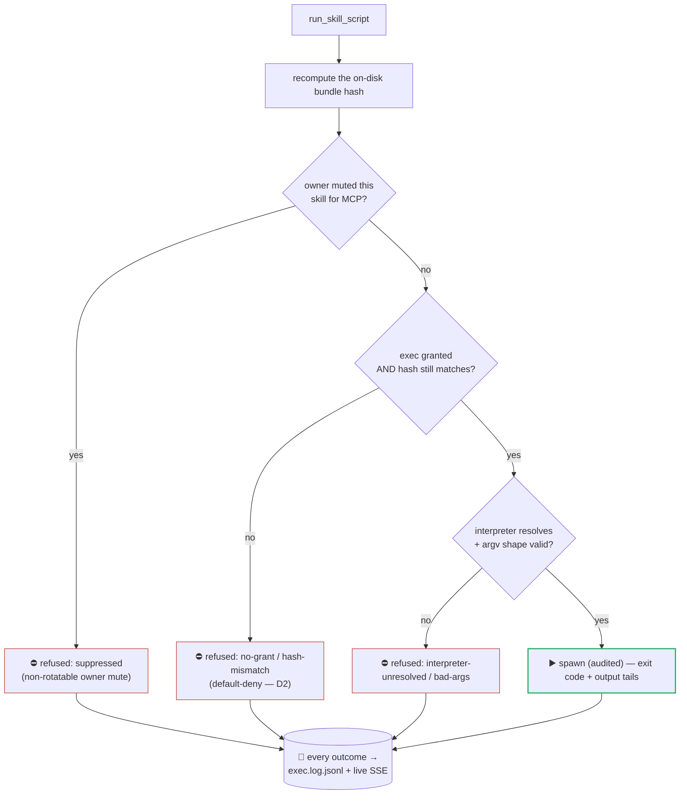
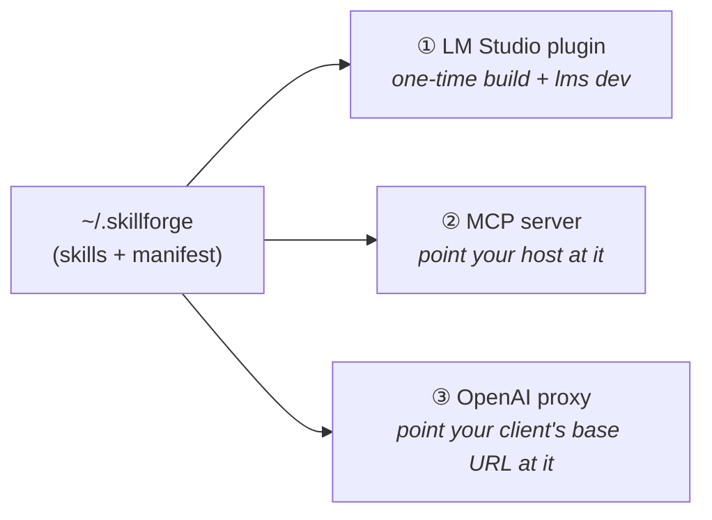
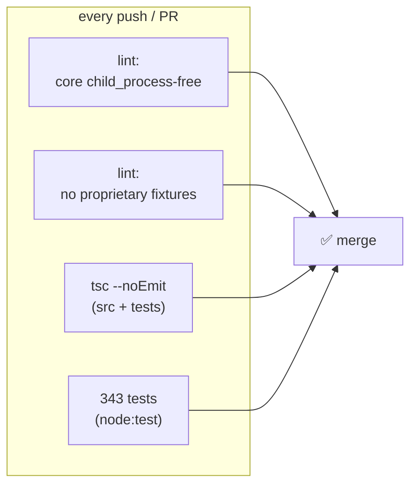

<div align="center">

# 🔥 skill-forge

### A local-first **skill runtime + visual manager** for local & open LLMs

Source [agentskills.io](https://agentskills.io) skills from anywhere — git, a folder, a registry, a URL — and skill-forge makes the **right one fire**, injected at runtime into **three targets** off one shared core.

[](LICENSE)
[](#dev-zero-install)
[](#testing--quality-gates)
[](#dev-zero-install)
[](#status)
[](https://github.com/gtm-k/skill-forge/actions/workflows/ci.yml)

**source → manage → route → inject** · It is *not* an authoring tool.

</div>

---

## Why

Your local model can't use the skills your cloud assistant can. agentskills.io is full of great skills, but a model running in **LM Studio**, **Ollama**, **llama.cpp**, or **vLLM** has no way to *find the right skill for the moment and inject it at the right time*. skill-forge is that missing layer — **fully local, on `127.0.0.1`, with every decision observable** ("never silent"). One engine routes; three thin adapters deliver.



---

## Architecture — the leverage point

One pure core does the work: **source → normalize → index → SELECT → INJECT**. Everything else is a thin adapter that *places* that injection into its channel, or an optional local daemon that accelerates and observes it.



**Five resolutions baked in:** ① the headline (a skill *firing* in a real chat) ships first, not the proxy; ② parity is **proven, not asserted** (a golden routing gate compares every adapter to core); ③ `schemaVersion` from day one; ④ the daemon is an **optional accelerator**, never on the chat's critical-fail path; ⑤ injection is **channel-agnostic content + per-adapter placement** — core emits `InjectionContent`, each adapter places it per its channel's persistence semantics.

---

## How a skill gets chosen — tiered selection

Selection escalates only as far as it must, and **makes "inject nothing" legible** — a wrong skill is worse than none.



Spike A0 measured this against live LM Studio: lexical-only peaks at **77%** precision@1; adding the semantic tier reaches **93%** at ≤7% false-fire. *What you see in the Route/Test tab is exactly what fires.*

---

## Three targets, one decision — the injection model

The same selected `InjectionContent` is **placed differently** per channel, matching each channel's persistence semantics:



| Target | Channel | Placement | Proof you can see |
|---|---|---|---|
| **LM Studio** | GUI chat | user-turn rewrite, persisted | the skill block in the saved transcript; `injectedBytes` in `inject.log.jsonl` equals the bytes that landed |
| **MCP** | any MCP host | `list_skills` · `load_skill` · `run_skill_script` | host menu; a no-grant run returns a **named, audited** refusal |
| **Proxy** | `/v1/chat/completions` | ephemeral system message | `X-Skill-Injected` / `-Disclosure` / `-Tier` response headers + a `select.log.jsonl` line |

---

## Safety model — default-deny, every refusal observable

Scripts never run silently. **One audited execution chokepoint** gates every run; a refusal is always surfaced by *name* and written to the audit log — never a silent no-op.



Hardening highlights: array-argv `spawn` (no shell, no command-injection surface); HTTPS-only clone with SSRF guards; a **local-only admission gate** (non-local Host/Origin → 403); content-hash-bound exec grants that auto-revoke on resync; and a **per-skill, non-rotatable MCP run-mute** enforced at the core chokepoint on both the live and daemon-down paths.

---

## Monorepo

| Package | What | |
|---|---|---|
| `@skillforge/contracts` | shared types, `schemaVersion`, tuned routing thresholds, golden fixtures | ✅ |
| `@skillforge/core` | the engine — `normalize` + tiered `select` + `inject` + the exec chokepoint | ✅ |
| `@skillforge/daemon` | local `node:sqlite` read-model store, REST + SSE on `127.0.0.1`, serves the UI | ✅ |
| `@skillforge/cli` | `skill-forge add` / `list` — sourcing (git / folder / registry / url) | ✅ |
| `@skillforge/lmstudio` | LM Studio plugin (GUI chats) | ✅ |
| `@skillforge/mcp-server` | MCP skill-server for any MCP host (stdio + HTTP) | ✅ |
| `@skillforge/proxy` | OpenAI-compatible proxy (Ollama · llama.cpp · vLLM · any OpenAI-compat agent) | ✅ |
| `@skillforge/ui` | read-only visual manager (Skills · Sources · Route/Test · Activity · Status) | ✅ |

---

## Quickstart

```bash
# 0. Zero-install: junction the workspace packages into node_modules (stand-in for pnpm install)
node scripts/link-workspace.mjs

# 1. SOURCE a skill (git URL or local folder) into your home; prints a humble capability inventory
SKILLFORGE_HOME=/tmp/sf node --experimental-strip-types packages/cli/src/bin.ts add <git-url | folder>
SKILLFORGE_HOME=/tmp/sf node --experimental-strip-types packages/cli/src/bin.ts list

# 2. BOOT the daemon + visual manager (both flags required: type-stripping + node:sqlite)
SKILLFORGE_HOME=/tmp/sf node --experimental-strip-types --experimental-sqlite packages/daemon/src/bin.ts
#   → daemon listening at http://127.0.0.1:4319/   (open it: Skills · Sources · Route/Test · Activity)

# 3. ROUTE a query headlessly (what you see here is what fires)
curl -s -X POST http://127.0.0.1:4319/route-test \
  -H 'content-type: application/json' -H 'origin: http://127.0.0.1:4319' \
  -d '{"target":"lmstudio","messages":[{"role":"user","content":"extract tables from a pdf"}]}'
```

The three inject targets — the LM Studio plugin (`packages/lmstudio-plugin/RUNBOOK.md`), the MCP server (`packages/mcp-server`), and the proxy (`packages/proxy`) — each embed the same core. A full end-to-end walkthrough lives in the private planning docs.

---

## Installation — wiring up the inject targets

Source your skills once (`skill-forge add …`, above), then turn on whichever targets you use. Each embeds the same core, so routing is identical across all three.



### ① LM Studio plugin (GUI chats)

The plugin can't be a normal package — `@lmstudio/sdk` only exists *inside* a built LM Studio plugin. So it's assembled once from LM Studio's reference RAG-v1 plugin with SkillForge swapped in. A script does the whole assembly:

```bash
# Prereq: install LM Studio's "RAG v1" plugin once — LM Studio → Discover → Plugins.
node scripts/build-lmstudio-plugin.mjs        # → builds ~/.lmstudio-skillforge-plugin
cd ~/.lmstudio-skillforge-plugin && lms dev   # builds + registers; leave it running (the one manual step)
```

> **What you should see:** `[esbuild] build finished …` then `[PromptPreprocessor] Register with LM Studio`. The plugin now appears (enabled) in LM Studio's **Plugins** panel.

Then add a skill into the home LM Studio reads (it does **not** inherit a shell's `SKILLFORGE_HOME`, so leave it unset) and chat:

```bash
SKILLFORGE_HOME= node --experimental-strip-types packages/cli/src/bin.ts add <git-url|folder>
```

In a GUI chat, send a message matching the skill (or an explicit `$slug`). **What you should see:** the skill's instructions **prepended to your turn and persisted** in the transcript; `tail -n 1 ~/.skillforge/inject.log.jsonl` shows an `injectedBytes` equal to the block that landed. Full walkthrough + the size-ceiling notes: [`packages/lmstudio-plugin/RUNBOOK.md`](packages/lmstudio-plugin/RUNBOOK.md).

### ② MCP server (Claude Desktop, Cursor, any MCP host)

Point your host at the stdio server (skills you've added become `list_skills` / `load_skill` / `run_skill_script` tools — the host picks):

```jsonc
// e.g. Claude Desktop / Cursor MCP config
{ "mcpServers": { "skillforge": {
    "command": "node",
    "args": ["--experimental-strip-types", "<repo>/packages/mcp-server/src/bin.ts"]
} } }
```

> **What you should see:** the three SkillForge tools in your host; a `run_skill_script` with no exec grant returns a **named, audited** `no-grant` refusal (default-deny). The daemon also mounts MCP over HTTP at `POST /127.0.0.1:4319/mcp`.

### ③ OpenAI-compatible proxy (Ollama, llama.cpp, vLLM, any OpenAI-compat client)

Run the proxy (set your model server as the upstream) and point your client's base URL at it:

```bash
SKILLFORGE_PROXY_PORT=4320 node --experimental-strip-types packages/proxy/src/bin.ts
# then use base URL  http://127.0.0.1:4320/v1  in any OpenAI-compatible client
```

> **What you should see:** chat responses carry `x-skill-injected` / `x-skill-disclosure` / `x-skill-tier` headers (the ephemeral injection is proof-in-headers). The daemon also serves `/v1/*` on `:4319`.

---

## Dev (zero-install)

Runs on **Node ≥ 22.18** via native TypeScript type-stripping — **no build step; the runtime has zero dependencies** (the only npm deps live in an isolated dev-only typecheck sidecar used by the `tsc` gate).

```bash
# Full suite — --experimental-sqlite is required for the daemon (node:sqlite) suite;
# some machines OOM without --test-concurrency=2.
node --experimental-strip-types --experimental-sqlite --test-concurrency=2 --test "packages/**/test/*.ts"

# The two other local gates (mirrored in CI):
node scripts/lint-core-no-child-process.mjs   # core stays child_process-free outside the audited exec chokepoint
node scripts/typecheck.mjs                     # tsc --noEmit over src + tests via the dev-only sidecar
```

---

## Testing & quality gates



The routing gate runs against **~28 real skills + a labeled query set**. Parity is **proven on three inject paths** against core — the LM Studio plugin (golden parity, D5), the proxy (golden parity), and the daemon `/route-test` (§8) — plus a **crash-restart** proof (DB rebuild + staleness, §5) and a **negative-set false-fire ceiling**. Lexical runs fully offline; the semantic tier uses a local embeddings endpoint and self-skips if none is reachable.

---

## Status

**MVP shipped** — runtime + visual manager working across all three injection targets, backed by the CLI, an optional local daemon, and a read-only UI. The LM Studio plugin's selection/injection is headless-tested; wiring it into LM Studio's GUI is a one-time manual step (`packages/lmstudio-plugin/RUNBOOK.md`).

---

## License

**Apache-2.0** — see [`LICENSE`](LICENSE).

The bundled fixture skills under `packages/contracts/fixtures/skills/` are vendored third-party content (Anthropic **Apache-2.0** skills and superpowers **MIT** skills). See [`NOTICE`](NOTICE) for the required attribution, [`THIRD_PARTY_LICENSES.md`](THIRD_PARTY_LICENSES.md) for the full upstream license texts, and [`ATTRIBUTIONS.md`](ATTRIBUTIONS.md) for the per-skill provenance map.
